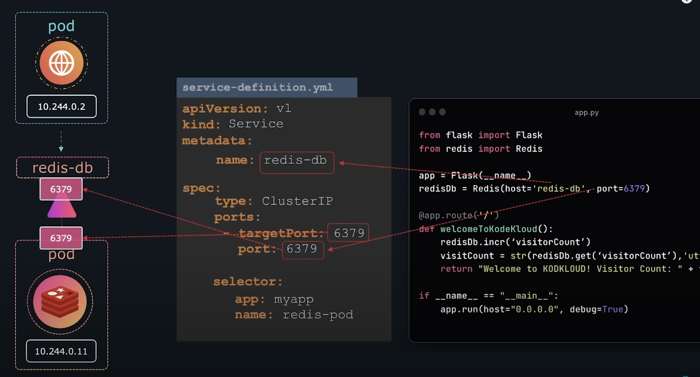
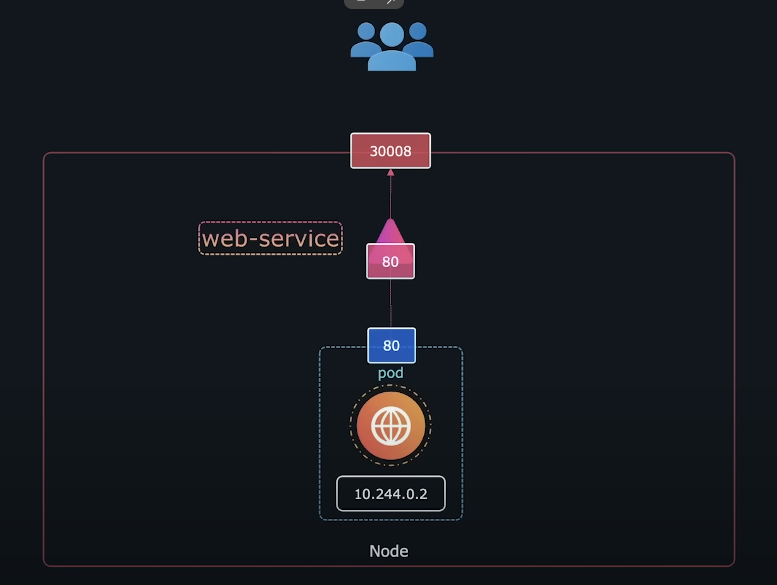
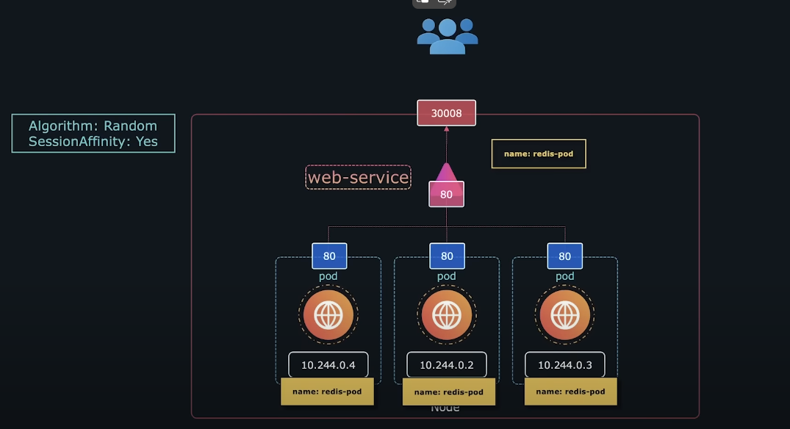
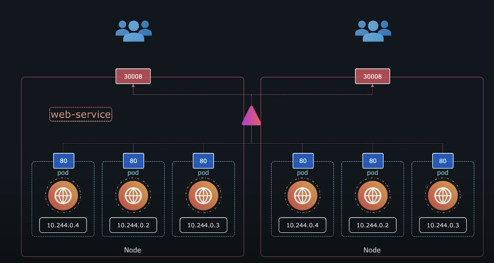

# Kubernetes Overview


**Kubernetes** is a container orchestration tool developed by Google that manages containers, such as Docker containers. It allows for various scaling techniques (up, down, blue-green, horizontal, vertical) and is more advanced than Docker Swarm.

#### Kubernetes Architecture

- **Master Node:**
  - Kube-controller-manager (API)
  - Kube-apiserver
  - Scheduler
  - Etcd

- **Worker Node:**
  - Services (kubelet, kube-proxy)
  - Pods

Kubernetes accesses images from DockerHub, AWS ECR, GitLab registry, and other sources.

### Kubernetes Commands

- Get Kubernetes version: `kubectl version`
- Get node's OS: `kubectl get nodes -o wide`
- List all nodes: `kubectl get nodes`
- List all pods: `kubectl get pods`


#### Kubernetes YAML File Schema

| Kind   | apiVersion     |
| ------------- | ------------- |
| Pod/Service | `v1` |
| ReplicaSet/Deployment | `apps/v1` |

Top-level keys: `apiVersion`, `kind`, `metadata`, `spec`

```yaml
apiVersion: (str) Specifies the Kubernetes API version to use, e.g., Pod/Service:v1, ReplicaSet/Deployment:apps/v1
kind: (str) Specifies the type of object to create (Pod/Service/ReplicaSet/Deployment). Case-sensitive.
metadata: (dict) Describes the object, includes keywords defined by Kubernetes.
  name: (str)
  labels: Custom tags
    app: 
    type:
spec (dict):
  containers (list): Specifies the containers in the pod
    - name: eg-nginx
      image: nginx
    - name: eg-myapp
      image: dpk-7/myappserver
```


### Pods
<details>
  <summary>A pod is the smallest object in Kubernetes and can run only one container. However, helper containers (agents) can collect logs or provide small services to the main instance running inside the pod.</summary>

**Creating a Pod:**
- Imperative: `kubectl run <pod name> --image=<image name>`
- Declarative: `pod-definition.yml`

```yaml
apiVersion: v1
kind: Pod
metadata:
  name: myapp-pod
  labels:
    app: myapp
    type: front-end
spec:
  containers:
    - name: nginx-container
      image: nginx
```

**Pod Commands:**
- Create pod: `kubectl create -f pod-definition.yml` or `kubectl apply -f pod-definition.yml`
- List pods: `kubectl get pods`
- List pods (detailed): `kubectl get pods -o wide`
- Describe a pod: `kubectl describe pod <pod name>`
- Check containers in a pod:
  1. `kubectl get pods` (Ready column shows the number of running containers)
  2. `kubectl describe pod <pod name>` (Containers listed under the Containers key)
- Delete a pod: `kubectl delete pod <pod name>`
- Create pod schema: `kubectl run <pod name> --image=<image name> --dry-run=client -o yaml > saveyaml.yaml`
- Edit pod: `kubectl edit pod <pod name>`
</details>

### ReplicaSets

<details>
  <summary>ReplicaSets ensure that the defined number of clones are met when a pod crashes/stops, ensuring high availability.</summary>

**Creating a ReplicaSet:**
replicaset-definition.yml
```yaml
apiVersion: apps/v1
kind: ReplicaSet
metadata:
  name: myapp-replicaset
  labels:
    app: myapp
    type: front-end
spec:
  replicas: 3
  selector:
    matchLabels:
      type: front-end
  template:
    metadata:
      labels:
        app: myapp
        type: front-end
    spec:
      containers:
        - name: nginx-container
          image: nginx
```

**ReplicaSet Commands:**
- Create ReplicaSet: `kubectl create -f replicaset-definition.yml`
- List ReplicaSets: `kubectl get replicaset`
- Delete ReplicaSet: `kubectl delete replicaset <name of replicaset>`
- Edit ReplicaSet: `kubectl edit replicaset <name of replicaset>`
- Explain ReplicaSet: `kubectl explain replicaset`

**Scaling a ReplicaSet:**
- Update the replica count in `replicaset-definition.yml` and run: `kubectl replace -f replicaset-definition.yml`
- Scale using command: `kubectl scale --replicas=6 -f replicaset-definition.yml` or `kubectl scale --replicas=6 replicaset myapp-replicaset`
</details>

### Deployment

<details>
  <summary>Deployments allow for rolling updates, rollbacks, and pausing/resuming updates.</summary>

**Creating a Deployment:**
deployments-definition.yml
```yaml
apiVersion: apps/v1
kind: Deployment
metadata:
  name: myapp-deployment
  labels:
    app: myapp
    type: front-end
spec:
  replicas: 3
  selector:
    matchLabels:
      type: front-end
  template:
    metadata:
      labels:
        app: myapp
        type: front-end
    spec:
      containers:
        - name: nginx-container
          image: nginx
```

**Deployment Commands:**
- Create deployment: `kubectl create -f deployment-definition.yml`
- List deployments: `kubectl get deployments`

**Deployment Structure:**
```
Deployment -> ReplicaSet -> Pods
```

**Upgrade Deployment:**
- Declarative: Update the `deployment-definition.yml` file and run: `kubectl apply -f deployment-definition.yml`
- Imperative: `kubectl set image deployment/<deployment name> <container name>=<image version>`

**Create Deployment (Imperative):**
- Example: `kubectl create deployment httpd-frontend --image=httpd:2.4-alpine --replicas=3`
</details>

### Services (Networking)

<details>
  <summary>Services manage communication within the cluster and expose applications externally.</summary>

**Service Types:**
1. **Cluster IP:** Internal cluster communication
2. **NodePort:** Exposes the application on a port on the node
3. **LoadBalancer:** Provisions a load balancer for the service

**Creating a Cluster IP Service:**
service-definition.yml
```yaml
apiVersion: v1
kind: Service
metadata:
  name: redis-db
  labels:
    app: myapp
    type: front-end
spec:
  type: ClusterIP
  ports:
    - port: 6379
      targetPort: 6379
  selector:
    app: myapp
    name: redis-pod
```

**Creating a NodePort Service:**
service-definition.yml
```yaml
apiVersion: v1
kind: Service
metadata:
  name: web-service
spec:
  type: NodePort
  ports:
    - port: 80
      targetPort: 80
      nodePort: 30008
  selector:
    app: myapp
    type: front-end
```


**Service Commands:**
- Create service: `kubectl create -f service-definition.yml`
- List services: `kubectl get services`
- Describe service: `kubectl describe service <service name>`

**NodePod Service:**



- Node external port range from 30000 – 32767 and are fixed
-	Creation:

service-definition.yml
```yml
apiVersion: v1
kind: Service
metadata:
  name: web-service
spec:
  type: NodePort
  ports:
    - targetPort: 80   # The port on the pod that the service should forward traffic to
      port: 80         # The port that will be exposed by the service
      nodePort: 30008  # The port on each Node where this service will be exposed
  selector:            # Selector to identify which pods the service should expose
    app: myapp
    type: front-end
```

> If you dont provide a target port its assumed to be same as port, and if node port is not provide, a free port in the valid range of 30000 – 32767 is automatically allocated.

- Create a pod: `kubectl create -f service-definition.yml`
- list services: `kubectl get services`
- list metadata: `kubectl describe servies <service name>`


We have multiple pods with same names then node service manages load to all the pods with the same name. in background it uses Random algorithm to decide which pod to have the load. Hence a load balancer.


</details>


### Helm Chat V3

<details>
  <summary>It is a Package manager similar to docker-complose/apt/yum</summary>

- ### About:
  - Helm helps you manage Kubernetes (K8s) applications with Helm charts, which help you define, install, and upgrade even the most complex Kubernetes applications.
  - Helm is the Kubernetes equivalent to package managers like yum or apt.
  - The main building block of Helm is Charts, which describe a configurable set of dynamically generated Kubernetes resources.
  - A Chart is a package that contains a collection of Kubernetes YAML manifests, allowing you to deploy and manage applications on your Kubernetes cluster.
  - Charts can be stored locally or fetched from remote chart repositories (e.g., https://artifacthub.io/).
  - Helm consists of two main components:
    - Helm CLI client: The command-line tool used by developers to manage charts and releases.
    - Tiller (deprecated in Helm v3): The server-side component that interacts with the Helm CLI (removed in Helm v3 for better security and simplicity).
  - Helm repositories can be public or private, allowing for the sharing and reuse of charts across different projects and teams.
  - Helm can manage the lifecycle of applications, including installation, upgrades, and rollbacks, providing version control for applications deployed on Kubernetes.
  - Folder Structure:

```
my-chart/
├── Chart.yaml             # Contains metadata about the chart
├── values.yaml            # Default configuration values for this chart
├── charts/                # Directory containing any dependent charts
├── templates/             # Directory containing template files that generate Kubernetes manifest files
│   ├── deployment.yaml    # Template for the deployment resource
│   ├── service.yaml       # Template for the service resource
│   ├── ingress.yaml       # Template for the ingress resource (optional)
│   ├── _helpers.tpl       # Template helpers (optional)
│   └── NOTES.txt          # Instructions for using the chart (optional)
└── README.md              # Optional readme file describing the chart
```

> `Chart.yaml`: The main file containing metadata about the chart.</br>
 `Values.yaml`: A file containing the default configuration values for the chart.</br>
 `Templates/`: A directory containing template files that generate Kubernetes manifest files.</br>
 `Charts/`: A directory containing any dependent charts.

- ### History:
  - Introduced in 2015.
  - Helm is now an official Kubernetes project and is part of the Cloud Native Computing Foundation (CNCF).
  - Helm uses a templating engine based on Go templates to dynamically generate Kubernetes manifest files from chart templates and values files.


</details>

## Projects:
- [Microservice: Deploying an voting app](Projects/sample_microservice_vote_app.md)


