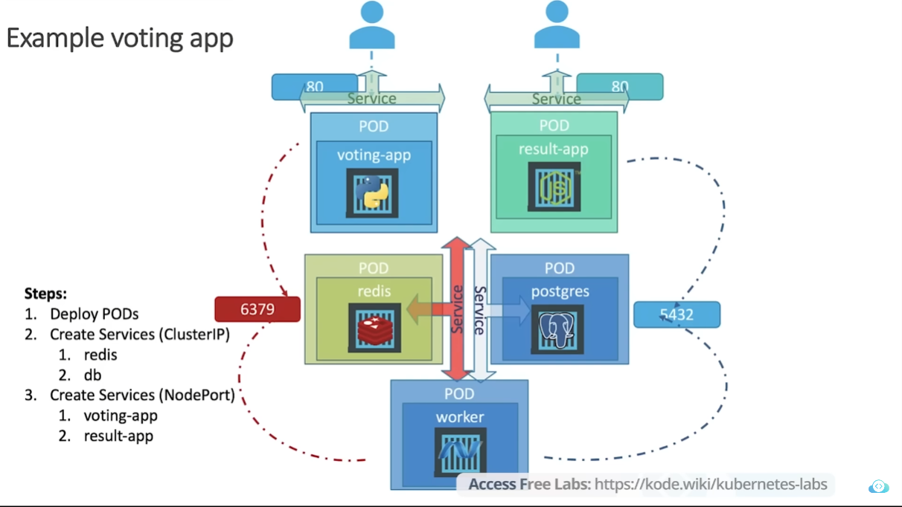

# Microservice: Deploying an voting app



voting-app-pod.yaml
```yaml
apiVersion: v1
kind: Pod
metadata:
  name: voting-app-pod
  labels:
    name: voting-app-pod
    app: demo-voting-app
spec:
  containers:
    - name: voting-app
      image: kodekloud/examplevotingapp_vote:v1
      ports:
        - containerPort: 80
```

voting-app-service.yaml
```yaml
apiVersion: v1
kind: Service
metadata:
  name: voting-service
  labels:
    name: voting-service
    app: demo-voting-app
spec:
  type: NodePort
  ports:
    - port: 80
      nodePort: 30004
  selector:
    app: demo-voting-app
```

voting-app-deploy.yaml
```yaml
apiVersion: apps/v1
kind: Deployment
metadata:
  name: voting-app-deploy
  labels:
    name: voting-app-deploy
    app: demo-voting-app
spec:
  replicas: 1
  selector:
    matchLabels:
      name: voting-app-pod
      app: demo-voting-app
  template:
    metadata:
      labels:
        name: voting-app-pod
        app: demo-voting-app
    spec:
      containers:
        - name: voting-app
          image: kodekloud/examplevotingapp_vote:v1
          ports:
            - containerPort: 80
```

result-app-pod.yaml
```yaml
apiVersion: v1
kind: Pod
metadata:
  name: result-app-pod
  labels:
    name: result-app-pod
    app: demo-voting-app
spec:
  containers:
    - name: result-app
      image: kodekloud/examplevotingapp_result:v1
      ports:
        - containerPort: 80
```

result-app-service.yaml
```yaml
apiVersion: v1
kind: Service
metadata:
  name: result-service
  labels:
    name: result-service
    app: demo-voting-app
spec:
  type: NodePort
  ports:
    - port: 80
      nodePort: 30005
  selector:
    app: demo-voting-app
```

redis-pod.yaml
```yaml
apiVersion: v1
kind: Pod
metadata:
  name: redis-pod
  labels:
    name: redis-pod
    app: demo-voting-app
spec:
  containers:
    - name: redis
      image: redis
      ports:
        - containerPort: 6379
```

redis-service.yaml
```yaml
apiVersion: v1
kind: Service
metadata:
  name: redis
  labels:
    name: redis-service
    app: demo-voting-app
spec:
  ports:
    - port: 6379
  selector:
    app: demo-voting-app
```

redis-deploy.yaml
```yaml
apiVersion: apps/v1
kind: Deployment
metadata:
  name: redis-deploy
  labels:
    name: redis-deploy
    app: demo-voting-app
spec:
  replicas: 1
  selector:
    matchLabels:
      name: redis-pod
      app: demo-voting-app
  template:
    metadata:
      labels:
        name: redis-pod
        app: demo-voting-app
    spec:
      containers:
        - name: redis
          image: redis
          ports:
            - containerPort: 6379
```

postgres-pod.yaml
```yaml
apiVersion: v1
kind: Pod
metadata:
  name: postgres-pod
  labels:
    name: postgres-pod
    app: demo-voting-app
spec:
  containers:
    - name: postgres
      image: postgres
      ports:
        - containerPort: 5432
      env:
        - name: POSTGRES_USER
          value: "postgres"
        - name: POSTGRES_PASSWORD
          value: "postgres"
```

postgres-service.yaml
```yaml
apiVersion: v1
kind: Service
metadata:
  name: postgres
  labels:
    name: postgres-service
    app: demo-voting-app
spec:
  ports:
    - port: 5432
  selector:
    app: demo-voting-app
```

postgres-deploy.yaml
```yaml
apiVersion: apps/v1
kind: Deployment
metadata:
  name: postgres-deploy
  labels:
    name: postgres-deploy
    app: demo-voting-app
spec:
  replicas: 1
  selector:
    matchLabels:
      name: postgres-pod
      app: demo-voting-app
  template:
    metadata:
      labels:
        name: postgres-pod
        app: demo-voting-app
    spec:
      containers:
        - name: postgres
          image: postgres
          ports:
            - containerPort: 5432
          env:
            - name: POSTGRES_USER
              value: "postgres"
            - name: POSTGRES_PASSWORD
              value: "postgres"
```

worker-app-pod.yaml
```yaml
apiVersion: v1
kind: Pod
metadata:
  name: worker-app-pod
  labels:
    name: worker-app-pod
    app: demo-voting-app
spec:
  containers:
    - name: worker-app
      image: kodekloud/examplevotingapp_worker:v1
```