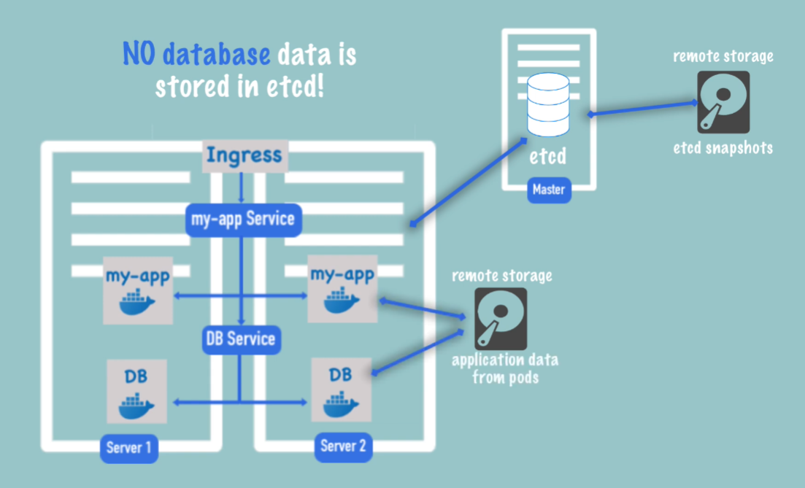

# Kubernetes Overview

**Kubernetes** 
- Open source container orchestration tool (manages multiples containers)
- Developed by Google
- Helps you  manage containerized applications in different deployment environments
    - physical
    - cloud
    - virtual

**Kubernetes Impact** 
- **Withour K8s**
    - Trend from monolith to microservices
    - Increased usage of containers
- **With K8s**
    - High Availability/ Zero downtime
    - Scalability/ High performance
    - Disaster recovery - Backup and restore
    - Hardware resouce management for each pods

# Advantages of K8s compared to others like AWS, Azure services
- Replication is easier
- Self-healing of K8s (Recreation of died Pod)
- Smart scheduling (K8s finds best Node to run the created Pod)

#### Kubernetes Architecture

- **Master Node:**
  - Loosing masternode is loosing access to cluster
  - Requires less resource
  - Its Ideal to have 1 backup of master node running
  - Companies preffer having more than 2 master nodes running
  

Kube-apiserver

   - Its a container
   - Only Entrypoint to K8s Cluster communication
   - Client like UI, API, CLI use it
  
 
  

Kube-controller-manager (API)

  - Keeps track of health of cluster
  

  

Scheduler

  - Ensures Pods placement
  - Creation of Pods inside of nodes based on workload
  - Backup and Restore on disaster recovery are made from etcd snapshots
  

  

Etcd

  - Backing store
  - Key-Value pair Db
  - Stores all the meta data, status data of each node and container
  

- **Virtual Network**
  - It glues all the Nodes inside the cluster into one powerful machine
  - Creates one unified machine

- **Worker Node:**
  - Dependent on Master Node
  - Requires higher resource
  

Services (kubelet, kube-proxy)

  

Pods

  
   - Smallest unit 
   - Abstraction/Wrapper over container(s)
   - Idea 1:1 for a pod:container, but pod can contain sub helper container required by the running container
   - Each pod is assigned New Internal IP (not the container) by Virtual Network on creation/re-creation
   - **Services**
        - Permanent IP (To manage dynamic ip)
        - Load balancer
        - Types:
        1) External Service:
            - Opens Communition from external sources
            - IP Range: 30000 – 32767
            - To have a secure protocol for access rather the ip:port, Ingress is used.
        2) Internal Service
  

Kubernetes accesses images from DockerHub, AWS ECR, GitLab registry, and other sources.

### Kubernetes Configuration
All the configuration in K8s cluster goes through a master node(API Server), And request is made in YAML or JSON format

### ConfigMap & Secret
We can use this Variables/definitions in app or service file using env variable or property file
> ConfigMap:\
    - Excternal configurations of deploy app.\
    - Example: Urls, dir path, etc.

> Secret:\
    - To store Credentials, certificates, etc.\
    - Similar to config map, used to store secret data\
    - Stored in base64 encode

### Volumes
- Attaches physical storage to the pod
- Attached storage can be local/ remote
- Use to avoid data loss when pod fails
- Data is not managed by K8s and its owners risk

## Deployment & Stateful Set
In practice we use deployments rather pods/replica files.
For Pods without state, Deployment cant be use.
> Deployment:\
    - For stateless Apps\
    - A blueprint to manage Pods and ReplicaSets for scaling and updates. \
    While Service provides networking and load balancing for Pods and is not managed by Deployments\
    - Abstraction of Pods\

Note: DB can't be replicated via Deployment. DB has state (data), if we have clones/replicas of DB it will perform async operation to Volume attached leading to inconsistancy.
> Stateful Set:\
    - For stateful Apps/Db\
    - Manages Pod, replicas scale but ensuring read, write to volume is synchronus.

Since its complex to manage DB in cluster, its recommended to use Hosted DBs like AWS Redshift, or RDS.

## K8s Architecture

**Node process:**
 - Each Node has multiple Pods on it
 - 3 Processes must be installed on every Node:
    - `Container Runtime` (Docker)
    - `Kubelet`: interacts with container and node
    - `Kube proxy`: forwards the requests
-  Communication via Services

**Master process:**
  - 4 Processes must be installed on every Master Node:
    - `API server`: User interacts with API server to manage/interact the cluster. (Cluster gateway), It also a FireWall authentication.\
    Some request -> API Server -> Validation -> Process
    - `Scheduler`: Creation of pod in a balanced nodes env.\
    Creating a Pod: Schedule New Pod -> API Server -> Scheduler -> Node(Kubelet) -> Pod
    - `Controller manager`: It detects cluster state changes (eg. died pod)\
    Pod Dies -> Controller Manager -> Scheduler -> Node(Kubelet) -> Pod
    - `ETCD Database`: Key-Value store of cluster state information. Scheduler and Controller Manager use etcd monitor the cluster

In an ideal deplotment, master nodes will have:
 - load balanced API server
 - ETCD as distributed storage across all master nodes.

## Disaster recovery:
ETCD: Snapshots of ETCD is crutial in production, since it stores all the cluster informations, and kubernetes doesn't ensures backup for it.

## MiniKube
- Creates Master node setup for kubectl
- Testing purpose
- creates Virtual Box on your system
- Node runs in Virtual Box
- 1 Node K8s cluster
- Commands:
 - minikube start
 - minikube status
 - minikube stop

## Kubectl
- Command line tool for K8s cluster 
- Interacts with the API server of the master node

## Layers of abstraction:
1) Deployment manages Replicaset
2) Replicaset manages all the replicas of the Pod
3) Pod is an abstraction of container

Everything below Deployment is handled by K8s.\
> Instance naming:`<deployment name>-<replicaset name>-<Pod name>`

## Kubectl commands:
- List pods/deployment/replicaset/services: `kubectl get <pods/deployment/replicaset/services>`
- Edit deployment configuration: `kubectl edit deployment <deployment name>`
- Logs: `kubectl logs <pod name>`
- Description: `kubectl describe <pods/deployment/replicaset/services> <name of pods/deployment/replicaset/services>`
- Intective Terminal/Login to Pod: `kubectl exec -it <pod name> -- bin/bash`
- Delete: `kubectl delete <pods/deployment/replicaset/services> <name of pods/deployment/replicaset/services>`
- create deployment from config yml: `kubectl apply -f <file name.yml>`
> If the deployment is not created K8s will create it else K8s will update the deployment running

# K8s Config file (YAML)